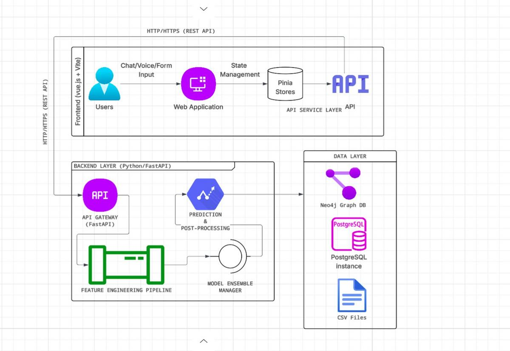

# Graph-Enhanced LLMs for Locally Sourced Elderly Nutrition Planning in Uganda

An AI-powered nutrition planning system combining Graph Neural Networks to provide personalized, culturally-appropriate meal recommendations for elderly populations in Uganda.

**Group:** SW-AI-15 | **Institution:** Makerere University | **Supervisor:** Ggaliwango Marvin

## Team

### Current Members

| Name | Role | Contact |
|------|------|---------|
| **Nannyombi Shakiran** | Project Lead, ML Engineer | [shakirannannyombi@gmail.com](mailto:shakirannannyombi@gmail.com) |
| **Yul Lam Gatkuoth** | Data Engineer, Frontend Developer | [gatkuothyullam@gmail.com](mailto:gatkuothyullam@gmail.com) |

---

## Deployment & Resources

Access all components of the MzeeChakula ecosystem:

| Component | Description | Link |
|-----------|-------------|------|
| **Frontend UI** | User interface for elderly & caregivers | [Launch App](https://mzeechakulaaissistant.vercel.app) |
| **Backend API** | FastAPI documentation & endpoints | [API Docs](https://mzeechakula-user-interface-backend.onrender.com/docs) |
| **AI Model** | Ensemble Nutrition Model & Embeddings | [Hugging Face](https://huggingface.co/Shakiran/MzeeChakulaNutritionEnsembleModel) |
| **Data & Analysis** | Datasets and exploration notebooks | [Kaggle](https://www.kaggle.com/datasets/shakiran/nutrition-graph-data) |
| **Model Testing** | Performance evaluation & benchmarks | [Model Testing](https://mzeechakula.vercel.app) |
| **Model Testing Backend** | Performance evaluation & benchmarks | [Model Testing](https://mzeechakula-backend.onrender.com) |
| **Documentation** | Project documentation & setup | [Documentation](https://mzeechakula.github.io/Documentation/) |

---

## Overview

**MzeeChakula** (Swahili for "Elderly Food") addresses critical nutrition challenges facing Uganda's elderly population:

- **28%** of the elderly are undernourished (WHO 2022)
- **45%** suffer from diet-related chronic conditions
- Only **1 nutritionist per 50,000 people** in rural areas
- Limited access to personalized dietary guidance using locally available foods

### Our Solution

A hybrid AI system featuring:

1. **Knowledge Graphs** - 1,048 nodes, 14,359 edges mapping food→nutrient→condition relationships
2. **9 Graph Neural Networks** - Advanced GNN architectures evaluated and compared
3. **Ensemble Model** - Production-ready model combining top 3 GNNs (CRGN, HetGNN, GAT)
4. **Culturally-Adapted** - English and Luganda support, local foods focus

## System Architecture



The system is built on three core layers:

1. **Knowledge Graph Layer** - Neo4j database with 1,048 nodes and 14,359 edges representing foods, nutrients, health conditions, cultural practices, and seasonal availability
2. **GNN Ensemble Layer** - 9 Graph Neural Network models (CRGN, HetGNN, GAT, R-GCN, Graph-RAG, KGNN, G-GPT, GRN, TCN) that reason over the knowledge graph
3. **Application Layer** - FastAPI backend with ChromaDB vector store, Vue 3 frontend, and multi-language voice interface


## Technical Stack

### Core Technologies

| Category | Technology | Purpose |
|----------|-----------|---------|
| **Deep Learning** | PyTorch 2.0+, PyTorch Geometric | GNN models |
| **GNN Architectures** | CRGN, HetGNN, GAT + 6 others | Nutrition reasoning |
| **Ensemble** | Custom weighted ensemble | Production model |
| **Data Processing** | Pandas, NumPy | Data manipulation |
| **Graph Database** | Neo4j 5.0+ | Knowledge graph storage |
| **Notebooks** | Jupyter Lab | Research & development |
| **Visualization** | Matplotlib, Seaborn, Plotly | Analysis & results |

---

## Performance Benchmarks

**CPU (Intel i7):**
- Single prediction: 0.5 ms
- Top-10 recommendations: 15 ms
- Batch (100 users): 1.5 seconds

**GPU (NVIDIA T4):**
- Single prediction: 0.1 ms
- Top-10 recommendations: 3 ms
- Batch (100 users): 0.3 seconds

### Supervisor

**Ggaliwango Marvin**
Department of Computer Science
Makerere University

---

## Citation

If you use this work in your research:

```bibtex
@software{mzeechakula2025,
  title={MzeeChakula: Graph-Enhanced Nutrition Planning for the Elderly in Uganda},
  author={Nannyombi, Shakiran and Gatkuoth, Yul Lam},
  year={2025},
  institution={Makerere University},
  supervisor={Ggaliwango, Marvin}
}
```

---

## Acknowledgments

### Data Sources

- Uganda Food Composition Tables (2019) - Ministry of Health
- WHO Elderly Nutrition Guidelines
- FAO/INFOODS Food Composition Database

### Technical Infrastructure

- Neo4j - Graph database platform
- PyTorch & PyTorch Geometric - Deep learning frameworks
- Hugging Face - Model hosting
- Weights & Biases - Experiment tracking

### Special Thanks

- Community health workers across Uganda
- Elderly participants who shared dietary information
- Makerere University Department of Computer Science
- Open-source ML/AI community

---

## License

This project is licensed under the **MIT License** - see the [LICENSE](LICENSE) file for details.

---

## Contact & Support

### Questions or Issues?

- **General Inquiries:** [shakirannannyombi@gmail.com](mailto:shakirannannyombi@gmail.com)
- **Collaboration:** [gatkuothyullam@gmail.com](mailto:gatkuothyullam@gmail.com)

---

<div align="center">
**Made with ❤️ for Uganda's elderly population**
</div>

---

**Last Updated:** 2025-01-17
**Version:** 1.0.0
**Status:** Production / Live
